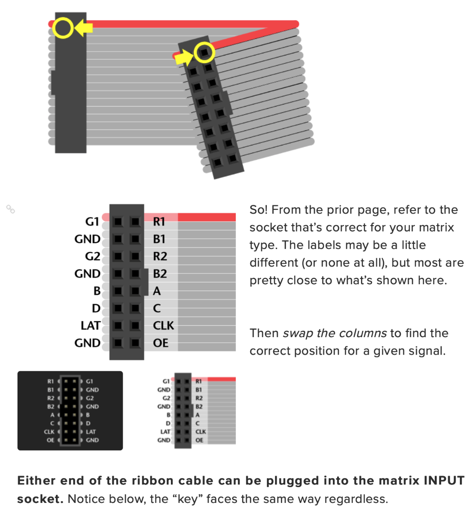

## RGB LED Matrix

The individually addressable RGB LED Matrix board uses HUB75 style pinout, for example: [Adafruit RGB LED matrix](https://www.adafruit.com/product/2279). It comes in many size: 64(col)x32(row), 32x32, 32x16, etc with various size pitch (2mm - 6mm commonly). Please do not use any power supply higher than 5V for this. It can handle power supply rated for more amps, e.g: 10A but never use one with higher voltage.

[If you're using these Adafruit matrices, be sure to read the operating guide first. ](https://learn.adafruit.com/32x16-32x32-rgb-led-matrix/powering)

This driver is written in [Lucid](https://alchitry.com/lucid) and is meant to be run on [Alchitry Au](https://www.sparkfun.com/products/16527) Boards + [Alchitry Br](https://www.sparkfun.com/products/16524) prototype element board.

### Scan rate

This driver is meant for matrices with scan rate of 2/R where R is number of rows. Hence, for 64x32: 1/16 scan rate, 32x16: 1/8 scan rate and so on. It will NOT work for 32x16 1/4 scan rate.

## Demo

Connect all relevant pins to the following Br pins. They can be found under constraint `custom.acf`.

```
// to LED matrix
pin red0 C49;
pin red1 C48;
pin green0 C46;
pin green1 C45;
pin blue0 C43;
pin blue1 C42;

pin latch C2;
pin blank C5;
pin sclk_out C8;

pin address[0] C3;
pin address[1] C6;
pin address[2] C9;
pin address[3] C12;
```

Here, `address[0]` will correspond to `A`, `address[1]` corresponds to `B`, and so on.

If you use ribbon connector, make sure to swap the columns:


Checkout branch `master`, and when compiled and loaded, you should see that all pixels are set to blue color.

## Usage

You can customise the parameter `ADDRESS_SIZE` (log2 of number of rows) and `MATRIX_WIDTH` (number of columns) when instantiating `matrix_writer.luc`.

It receives 6 bits input data, and outputs all necessary signals to the LED matrix.

```
    input data[6], // input data from a simple RAM [b1,g1,r1,b0,g0,r0], see sample data below
    ...

    // output to matrix
    output red0,
    output green0,
    output blue0,
    output red1,
    output green1,
    output blue1,
    output latch,
    output blank, // also known as OE
    output sclk_out,
    output address[ADDRESS_SIZE], //row address current write to LED matrix
```

If you're using a RAM to drive the `matrix_writer`, you may use its output: `row_index` and `col_index` to address the RAM, and the RAM's output should feed in to `data[6]` port of `matrix_writer.luc`.

## Sample with RAM

You may checkout the branch `matrix-with-ram` to see how we use a `ram_writer` to write into `matrix_ram`, which then be connected to `matrix_driver`. Note that the sample is unique to your own usage and you need to read the sample code to understand what you see.

Here's what you should see when you run it on 64x64 matrix:


