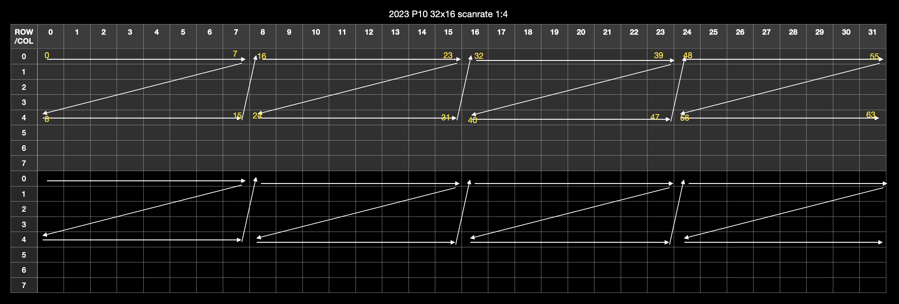

This driver assumes a zigzag mapping pattern as follows:



You can change `COL_MAPPING` in `matrix_writer_4nscanrate_p10.luc` to suit your own physical LED connections.

```
  const COL_MAPPING = {
    5d31,5d30,5d29,5d28,5d27,5d26,5d25,5d24,
    5d31,5d30,5d29,5d28,5d27,5d26,5d25,5d24,
    5d23,5d22,5d21,5d20,5d19,5d18,5d17,5d16,
    5d23,5d22,5d21,5d20,5d19,5d18,5d17,5d16,
    5d15,5d14,5d13,5d12,5d11,5d10,5d9,5d8,
    5d15,5d14,5d13,5d12,5d11,5d10,5d9,5d8,
    5d7,5d6,5d5,5d4,5d3,5d2,5d1,5d0,
    5d7,5d6,5d5,5d4,5d3,5d2,5d1,5d0
  };
```
